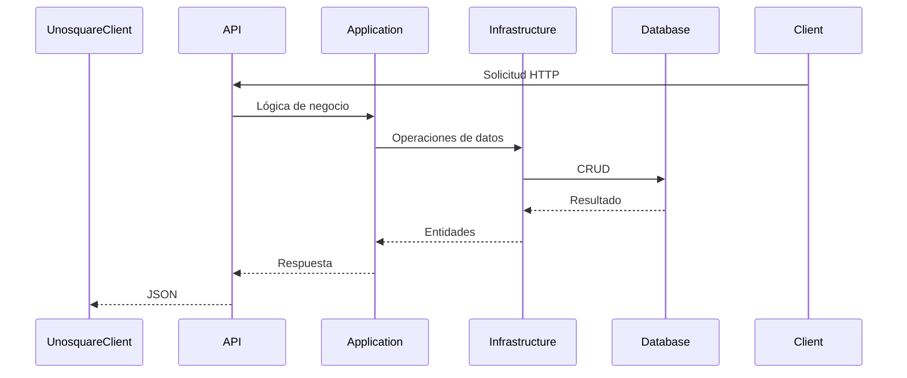

# Unosquare Products.

The project was created with .net core 9 and Database Postgresql.
It is a CRUD for products, it contains endpotints to CREATE, READ, UPDATE and DELETE.

Next i wil describe the content.

Under the folder of project there is two files:

1. unosquare_products_db_27_08_2025.sql
2. UnosquareProducts.postman_collection.json

unosquare_products_db_27_08_2025.sql is a backup of database of project, it contains some tables for auth and role, also it contains the table for the products.
Here a detail of the table:

	CREATE TABLE Products(
	  Id SERIAL PRIMARY KEY,
	  Description CHARACTER VARYING(200),
	  SKU CHARACTER VARYING(200),
	  Price numeric
	);

 UnosquareProducts.postman_collection.json is a postman collection. It contains all of endpoints done for can test the CRUD
 Under you can find:
 POST api/Token/login
 GET api/Products
 GET api/Products/{productId}
 POST api/Products
 PUT api/Products/{productId}
 DELETE api/Products/{productId}

 Each endpont on exception of Token, need an authorization token, it can obtained with the endpoint api/Token/login. And the credentials is on the collection Postman (UnosquareProducts.postman_collection.json)
 Also you can create news users accounts directly on the database in AspNetUsers and, must to create a new role asingment on AspNetUserRoles table.

 ### A little about the project.

 As i have told you before, the project was developed with .net core 9 and postgresql. It was organizated with a clean architecture.
 Here some about the proyects

 UnosquareProducts.API
   -> It have a presentation layer
 UnosquareProducts.Application
   -> It have the bussines rules and validations
 UnosquareProducts.Common
   -> It have the interfaces (contracts)
 UnosquareProducts.Domain
   -> It have the models of proyect
 UnosquareProducts.Infrastructure
   -> It have all of suppliers clases and conections with the exterior

### Flow of project

### Local instalation for test
1. Download the repository to a folder on your local machine
2. Go to the path of proyect (Befor you have downloaded).
3. If you have instalated Visual Studio just follow the next instructions:
   3.1 Make double click on UnoSquareProducts.sln
   3.2 When Visual Studio is ready press F5 or click on run
4. If you want to open with Visual studio code, have to follow the next instructions:
   4.1 Open a new terminal on the same path of project
   4.2 write the comand: "dotnet run" and wait the response and see the local url (can be there "http:localhost:5005")
5. Open postman and import the collection (UnosquareProducts.postman_collection.json)
6. You can test the project

 
